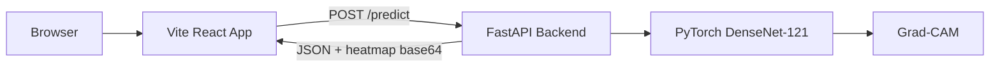

# Chest X-Ray AI Diagnosis System

An AI-powered chest X-ray analysis system with real-time local predictions using DenseNet-121 and Grad-CAM explainability.

## Project info

**URL**: https://lovable.dev/projects/a2d6fd51-34b1-4103-b4e1-09256e3c7981

## How can I edit this code?

There are several ways of editing your application.

**Use Lovable**

Simply visit the [Lovable Project](https://lovable.dev/projects/a2d6fd51-34b1-4103-b4e1-09256e3c7981) and start prompting.

Changes made via Lovable will be committed automatically to this repo.

**Use your preferred IDE**

If you want to work locally using your own IDE, you can clone this repo and push changes. Pushed changes will also be reflected in Lovable.

The only requirement is having Node.js & npm installed - [install with nvm](https://github.com/nvm-sh/nvm#installing-and-updating)

Follow these steps:

```sh
# Step 1: Clone the repository using the project's Git URL.
git clone <YOUR_GIT_URL>

# Step 2: Navigate to the project directory.
cd <YOUR_PROJECT_NAME>

# Step 3: Install the necessary dependencies.
npm i

# Step 4: Start the development server with auto-reloading and an instant preview.
npm run dev
```

**Edit a file directly in GitHub**

- Navigate to the desired file(s).
- Click the "Edit" button (pencil icon) at the top right of the file view.
- Make your changes and commit the changes.

**Use GitHub Codespaces**

- Navigate to the main page of your repository.
- Click on the "Code" button (green button) near the top right.
- Select the "Codespaces" tab.
- Click on "New codespace" to launch a new Codespace environment.
- Edit files directly within the Codespace and commit and push your changes once you're done.

## What technologies are used for this project?

This project is built with:

**Frontend:**
- Vite
- TypeScript
- React
- shadcn-ui
- Tailwind CSS
- React Router
- TanStack Query

**Backend:**
- FastAPI (Python)
- PyTorch & torchvision
- DenseNet-121 (ImageNet pretrained)
- Grad-CAM (pytorch-grad-cam)
- OpenCV & Pillow

## Local Offline Setup (No Cloud Dependencies)

This application runs completely locally with two services:



### Prerequisites

- **Node.js** (v18+) and npm
- **Python** (3.9+) and pip

### Step 1: Setup Backend (Terminal A)

```bash
# Navigate to backend directory
cd backend

# Install Python dependencies
pip install -r requirements.txt

# Start the FastAPI server
uvicorn main:app --host 0.0.0.0 --port 8000 --reload
```

The backend will be available at `http://localhost:8000`

### Step 2: Setup Frontend (Terminal B)

```bash
# Install Node dependencies
npm install

# Create local environment file
cp .env.local.example .env.local
# Edit .env.local and set VITE_API_BASE=http://localhost:8000

# Start the development server
npm run dev
```

The frontend will be available at `http://localhost:5173`

### Step 3: Access the Application

Open your browser and navigate to `http://localhost:5173`

### Docker Setup (Alternative)

If you prefer Docker:

```bash
# Build and run both services
docker-compose up --build

# Access the application at http://localhost:5173
```

## Features

- **AI Diagnosis**: 14-class multi-label classification (NIH ChestX-ray14)
- **Explainability**: Grad-CAM heatmap showing focus areas
- **Real-time**: Local inference with no cloud dependencies
- **User Management**: Authentication and session handling
- **Reports**: Generate and view PDF diagnostic reports

## API Documentation

When the backend is running, visit:
- Interactive API docs: `http://localhost:8000/docs`
- Alternative docs: `http://localhost:8000/redoc`

## Security Note

⚠️ **Important**: Never commit `.env` or `.env.local` files to version control. Use `.env.local.example` as a template.

If you've accidentally committed secrets:
1. Rotate all API keys immediately
2. Remove them from git history
3. Update `.gitignore` to prevent future commits

## How can I deploy this project?

Simply open [Lovable](https://lovable.dev/projects/a2d6fd51-34b1-4103-b4e1-09256e3c7981) and click on Share -> Publish.

## Can I connect a custom domain to my Lovable project?

Yes, you can!

To connect a domain, navigate to Project > Settings > Domains and click Connect Domain.

Read more here: [Setting up a custom domain](https://docs.lovable.dev/features/custom-domain#custom-domain)
